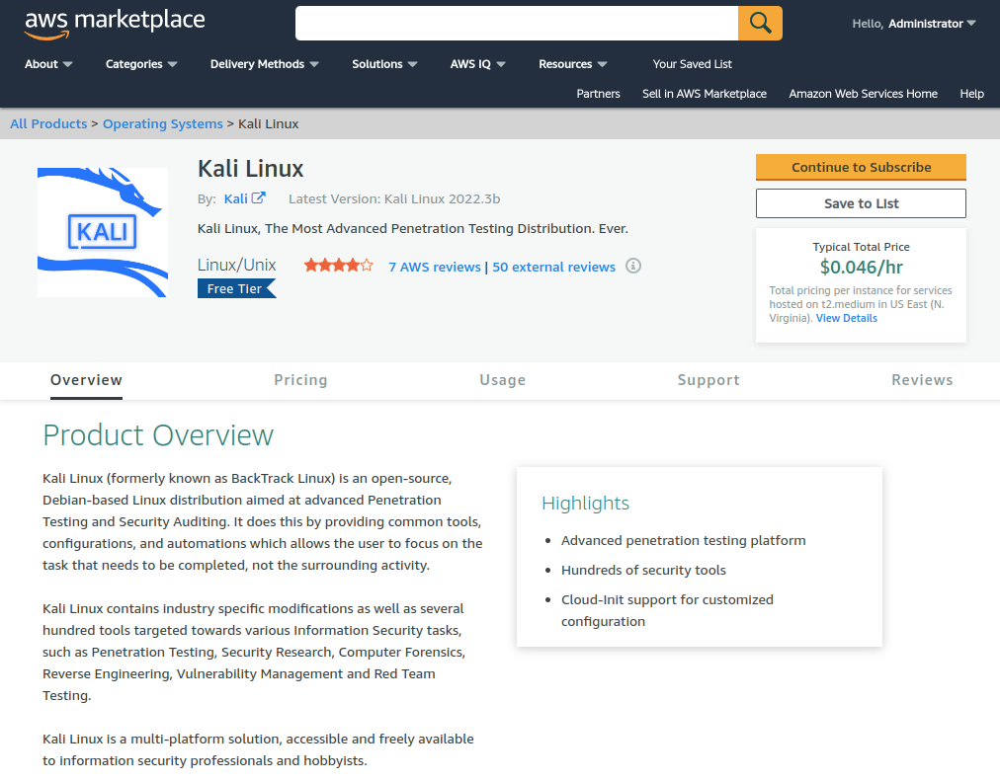
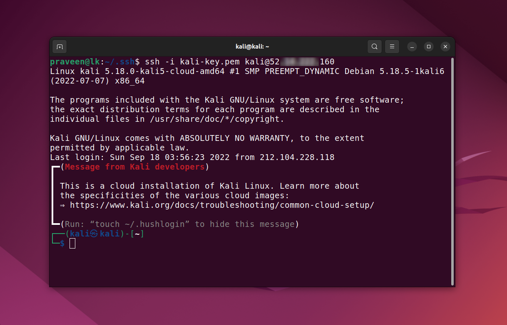
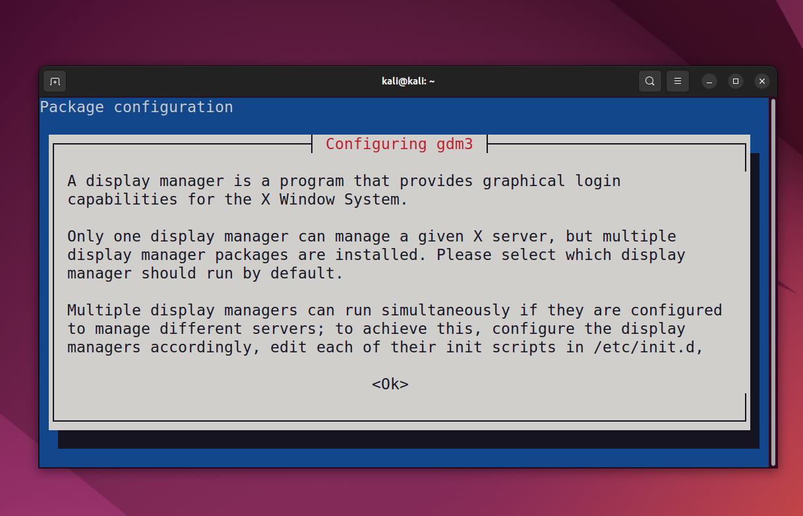
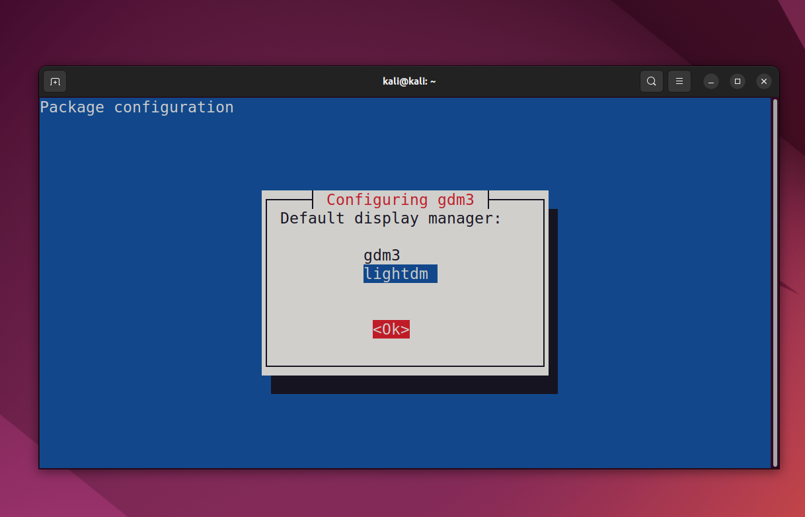

# Install Kali Linux on AWS EC2

## KALI

https://www.kali.org/


## AWS Kali



## Login to Kali



# Kali Lightdm

```
sudo apt install xfce4 xfce4-goodies tightvncserver
apt install kali-linux-full
apt install kali-linux-top-10

apt-get install gnome-core kali-defaults kali-root-login desktop-base
lightdm
```



