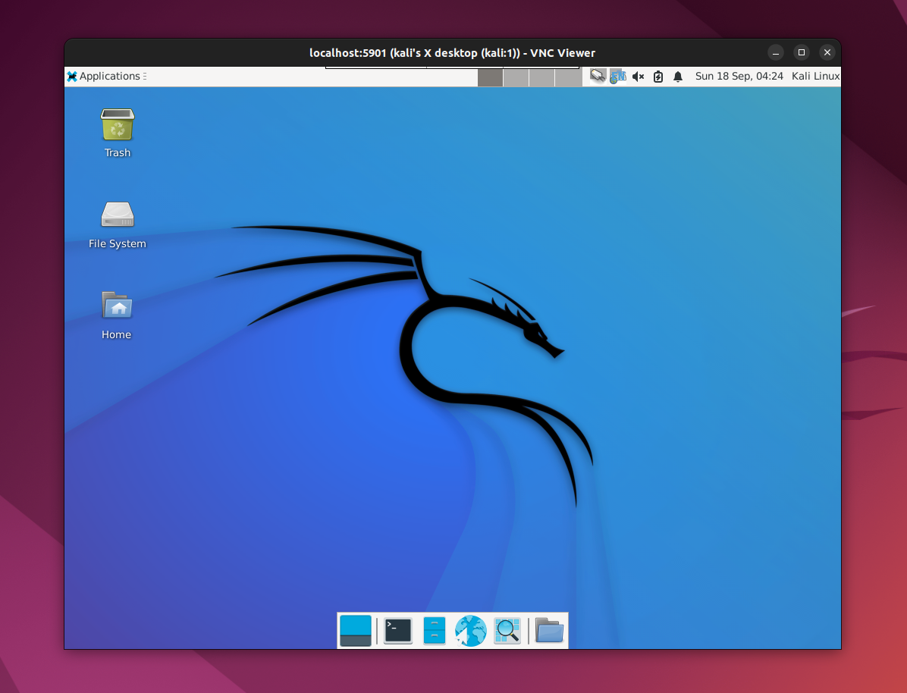

# Install Kali Linux on AWS EC2

## KALI

https://www.kali.org/


## AWS Kali


## Login to Kali


# Kali Lightdm

```
sudo apt install xfce4 xfce4-goodies tightvncserver
apt install kali-linux-full
apt install kali-linux-top-10

apt-get install gnome-core kali-defaults kali-root-login desktop-base
lightdm
```


# TightVNC

https://tightvnc.com/


```
tightvncserver -geometry 1024x768
netstat -tulpn
```

# Create a Tunnel and Connect

```
ssh -L 5901:localhost:5901 -N -f kali@52.xx.xxx.160 -i kali-key.pem
```



Use the Kali Remote Desktop. Kali on AWS EC2. Install full or top 10 Kali tools.

```
apt install kali-tools-full
apt install kali-tools-top10
```